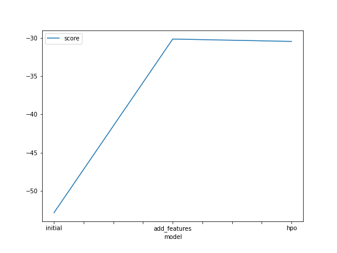
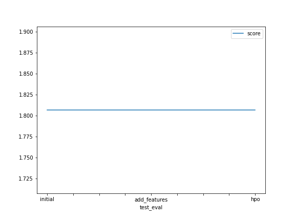

# Report: Predict Bike Sharing Demand with AutoGluon Solution
#### Eyup Acar

## Initial Training
### What did you realize when you tried to submit your predictions? What changes were needed to the output of the predictor to submit your results?
- As it says in the template Kaggle does not accept negative value predictions, when I .describe() the predictions I saw that min value was >0, so I didn't face any issue during submission.

### What was the top ranked model that performed?
- Top scored model was WeightedEnsemble_L3, its score was -30.146300

## Exploratory data analysis and feature creation
### What did the exploratory analysis find and how did you add additional features?
1. With explotary data analysis, histogram plots are created and we saw the distributions of features.
2. Casual and registered features seems to have outliers, since we did not take them for prediction, they are not causing any issues. 
3. Working day and holiday features could have been categorized in explotary data analysis.

### How much better did your model preform after adding additional features and why do you think that is?
- WeightedEnsemble_L3 was again best performant model. Model score increased from -52 to -30. But Kaggle score remained same. Changing dataset into the format that model can easily understand, increases the model performance.

## Hyper parameter tuning
### How much better did your model preform after trying different hyper parameters?
- I have tried many hyper parameter tunings from Autogluon Docs, these parameters might be performing better in larger or smaller datasets but for my dataset model score did not change significantly.  

### If you were given more time with this dataset, where do you think you would spend more time?
- Feature enginnering would be the first thing that I would work on. Model performance could get better with that.

### Create a table with the models you ran, the hyperparameters modified, and the kaggle score.
|model|time_limit|num_bag_sets|num_bag_folds|num_stack_levels|num_trials|score|
|--|--|--|--|--|--|--|
|initial|600|0|0|0|1|1.80677|
|add_features|600|0|0|0|1|1.80677|
|hpo|1000|5|5|3|5|1.80677|

### Create a line plot showing the top model score for the three (or more) training runs during the project.

### Create a line plot showing the top kaggle score for the three (or more) prediction submissions during the project.

## Summary
- The project was a good summary for the topics I have learnt in the lessons. Using them in a project and submitting to Kaggle is a great experience. Explotary Analysis is super important and every feature should be taken into account in order to get a better model performance.  Autogluon is a powerful tool and can be optimized in many ways. 